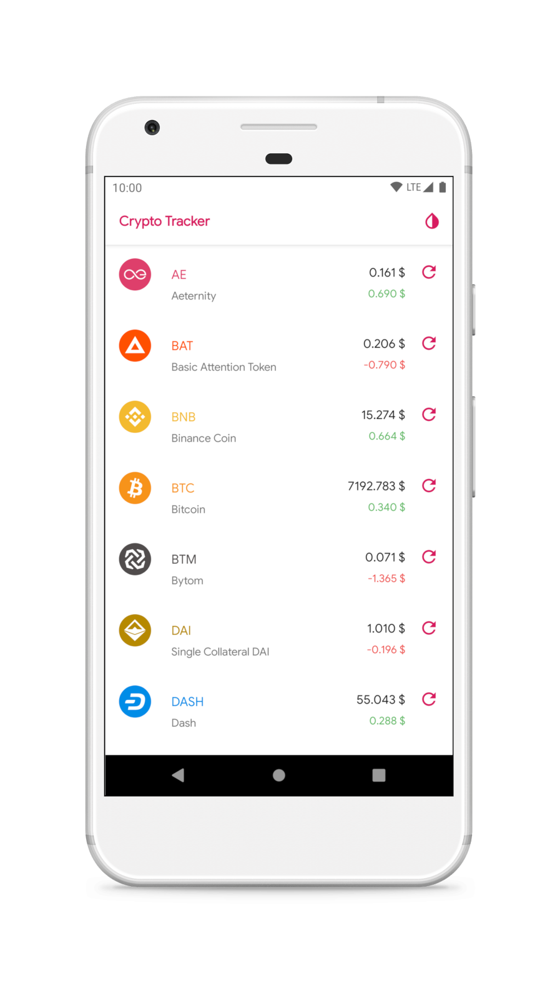
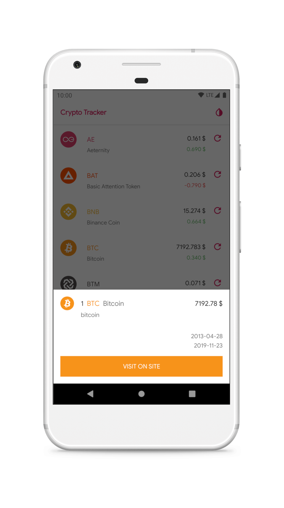
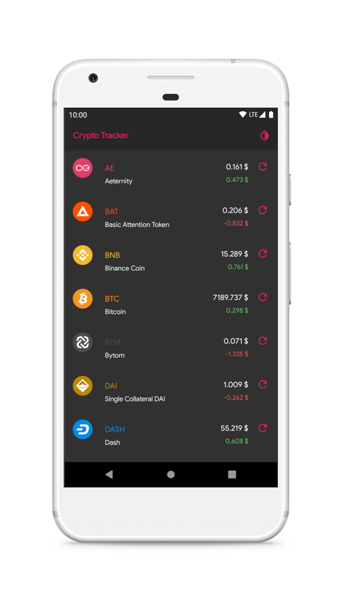
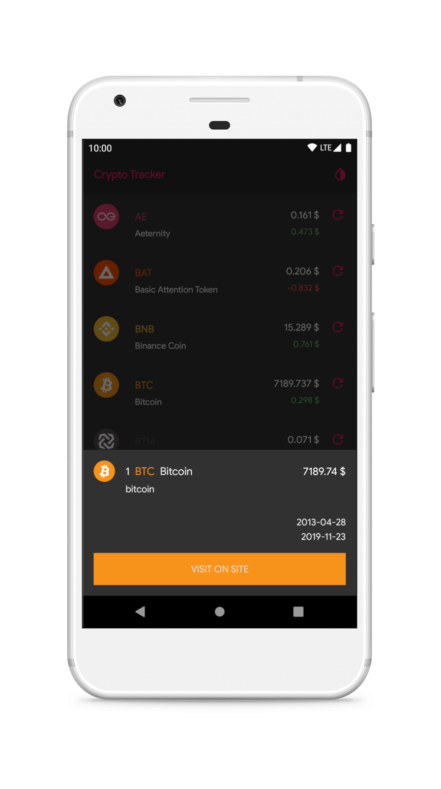

Crypto Tracker
=============

About
-------------

Demo application with statistics of some cryptocurrencies.

API
-------------

Provided by [CoinMarketCap](https://pro.coinmarketcap.com).

__API key__

In `CurrencyService` class replace `API_KEY` in each header.

Resources
-------------

Original icons provided by [cryptocurrency-icons](https://github.com/atomiclabs/cryptocurrency-icons).

Download
-------------

Screenshots
-------------

 

  
  
  
  

Contributors
-------------

* [@fartem](https://github.com/fartem) as Artem Fomchenkov
* [@alirezanazari](https://github.com/alirezanazari) as Alireza Nazari
