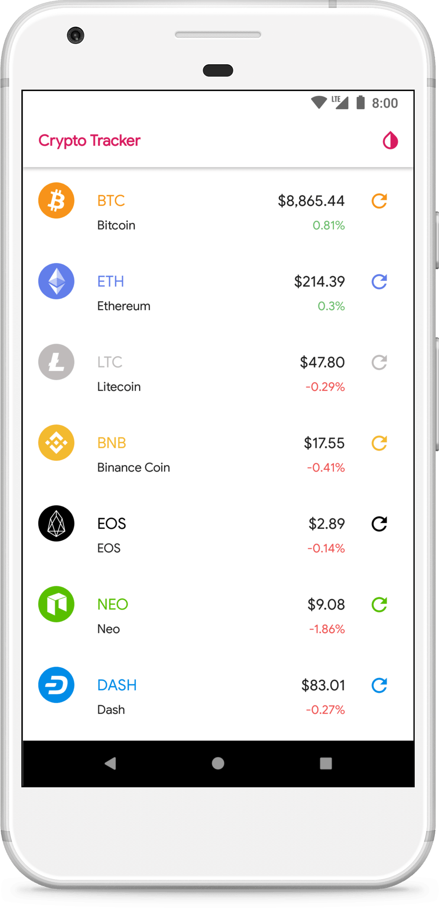
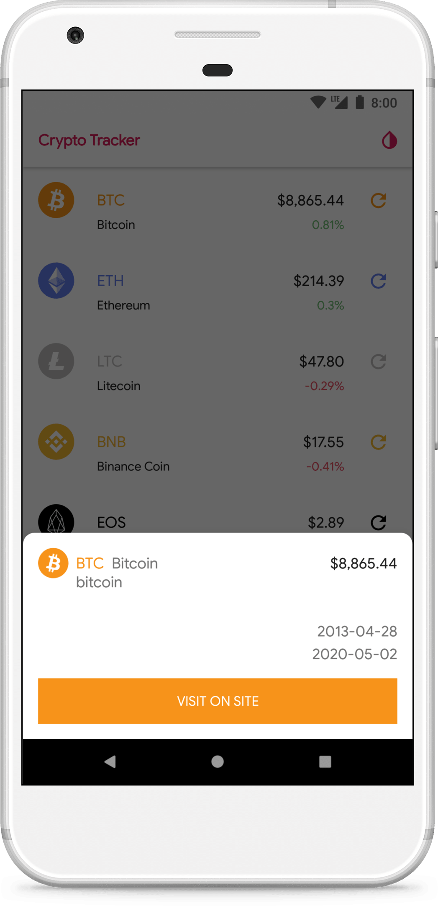
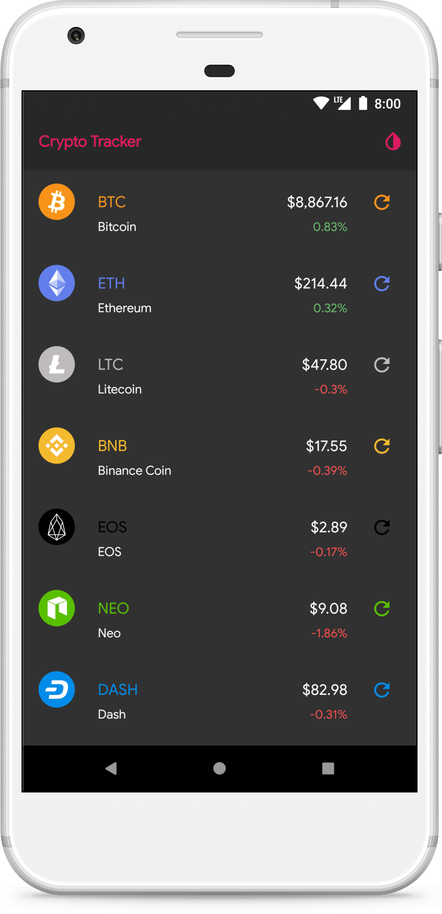

# Crypto Tracker

[](https://travis-ci.org/fartem/crypto-tracker)
[](https://codebeat.co/projects/github-com-fartem-crypto-tracker-master)
[](https://codecov.io/gh/fartem/crypto-tracker)
[](https://android-arsenal.com/details/3/7955)

## About

Demo application with statistics of some cryptocurrencies.

## API

### CoinMarketCap

__Resources__

[CoinMarketCap](https://pro.coinmarketcap.com).

__API key__

In `CurrencyService` class replace `API_KEY` in each header.

## Resources

Original icons provided by [cryptocurrency-icons](https://github.com/atomiclabs/cryptocurrency-icons).

## Download


## Screenshots

<br/>
<p align="center">
  
  
  
  
</p>

## How to contribute

Read [Commit Convention](https://github.com/fartem/repository-rules/blob/master/commit-convention/COMMIT_CONVENTION.md). Make sure your build is green before you contribute your pull request. Then:

```shell
$ ./gradlew clean
$ ./gradlew build
$ ./gradlew connectedDebugImplDebugAndroidTest
```

If you don't see any error messages, submit your pull request.

## Contributors

* [@fartem](https://github.com/fartem) as Artem Fomchenkov
* [@alirezanazari](https://github.com/alirezanazari) as Alireza Nazari
